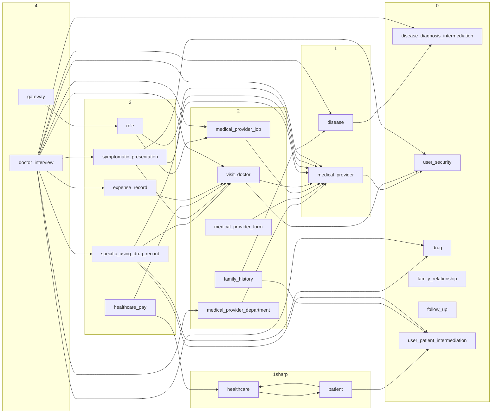

Readme

> 192.168.88.142 cloud.respiratory

## 前后端分离

>   采用Restful风格的代码进行前后端分离

## 客户端

### Netty

基于Netty构造的Http客户端发送请求-接收响应的工具

Netty基于Java的NIO开发, 有极好的异步开发能力, 能极大的提高程序运行效率

### Jackson

Json的解析和构造采用Jackson, Jackson具有轻量级, API简单, 功能强大的特点

### GUI

采用Java的Swing原生 API 构建 GUI

## 单体架构

1. 过多数据表转ER图
2. 数据的一致性问题
    - 为保证数据一致性, 导致事务的长时间阻塞表
    - 外键依赖导致在高并发场景下的效率降低-增删改检查
    - 异步写-消息队列
3. 慢查询-缓存
4.

### MVC

基于MVC架构开发

-   Model
-   View
-   Controller

## 用户鉴权

由于一个用户所持有的角色可以访问多个资源

而同一个资源又可以被不同的角色访问

这种复杂的关系不适合配置在Spring的Inspector上

故应该转换成关系表, 类似于有穷状态机, 以此进行了成功的解耦

### 用户校验

用jwt token无状态地存贮用户信息(json), 每次在请求头中携带

在网关截获token

1.   解析成`UserDto`对象后, 从数据库查询该用户对应的权限, 然后存入UserDto
2.   将解析后的`UserDto`再次转为json, 作为`user-info`的请求头转发给内部微服务
3.   微服务使用`interceptor`拦截发送给`Controller`的请求, 在`Controller`执行之前将`UserDto`解析成json, 并存入`ThreadLocal`
     -   因为, 无论是Spring老版本的Tomcat, 还是新版本的Netty, 都是一个请求一个线程的, 所以用户信息也应当是线程唯一的
4.   在服务内部的RPC调用时, 由于无法再获取请求头, 也不会经过`interceptor`, 所以定义规范, `UserDto`总是作为`Service`层方法的参数, 而`Service`不能使用`ThreadLocal`获取`UserDto`, 这一工作总是交由`Controller`层完成

### 访问控制

具体到数据, 哪些数据应该开放给用户, 哪些数据不应该开放给用户

例如, 用户不到万不得已, 不直接给用户显示身份证号和电话号码这种敏感信息

### 加密

敏感信息加密

有密码/身份证/电话号码/医保余额

加密后信息的查询

查询有模糊查询和精准查询

由于能通过模糊查询推测出加密前明文, 故此需求为假

精准查询, BCryptPasswordEncoder, BCrypt进行加密

Hash算法, 随机盐(防彩虹表), 匹配来校验

遍历全表-转换成明文-比对, 效率过低, 索引失效!

新增字段, 使用统一盐, 盐定期更换, 数据库存多版本的盐, 哈希索引定位

 1. 依据该版本盐转hash, 成功有匹配(进入3)
 2. 无匹配, 往回退一个版本, 进入1
 3. 将当前匹配到的记录, 重新用最新版本的盐替换这个记录上的hash

### 限流

使用黑名单进行限流

## docker 部署

### 镜像源

在部署docker的nacos镜像时, 突然发现镜像源无法连接

- 尝试重新配置镜像源, 在服务器配置VPN, 均失败.
- VPN 由于设备原因无法使用TUN, 即使成功配置VPN后能访问hub.docker, 也依旧不能拉取镜像
- 安装desktop docker, 利用windows上有的VPN, 不用镜像源, 直接从外网拉取镜像

### mysql镜像

在完成mysql的部署之后, 无法连接mysql服务器,

- 在服务器本地能通过curl命令访问服务器, 说明服务器部署无误
- 通过重启服务器解决

### nacos 注册中心

访问nacos服务器时, nacos服务器无法启动
- nacos初始化需要数据库对nacos上的数据进行持久化
- 配置的mysql服务器错误, 重新配置后解决

## 微服务

### 拆分分布式

1. 传统的外键依赖, 无法跨多个库, 甚至服务器
2. 联表查询的场景中, 无法跨服务器去进行连接(内连接, 左连接, 右链接)
    - 一般, 将联表查询的部分放到Service层完成, 查询出有关ids, 然后用in语句来批量查询
    - 优点: 防止了DAO层的过于复杂的SQL
    - 缺点: DAO的业务入侵了Service层
    - 解决方案, 保存多分中间表(其实只要保存在有查询业务的那一边), 然后进行本地的连接查询

### 服务依赖

循环依赖的

patient - healthcare

无依赖的:

- disease_diagnosis_intermediation 0
- user 0
- drug 0
- family_relationship 0
- follow_up 0
- user_patient_intermediation 0

依赖关系

- medical_provider 1
    - user 0

- disease 1
    - disease_diagnosis_intermediation 0

- healthcare 1*
    - patient 1*
- patient 1*
    - healthcare 1*
    - user_patient_intermediation 0
- medical_provider_department 2
    - medical_privider 1
- medical_provider_role 2
    - medical_privider 1
- medical_provider_job 2
    - medical_privider 1
- family_history 2
    - disease 1
    - user_patient_intermediation 0
- visit_doctor 2
    - user 0
    - medical_privider 1
- healthcare_pay 3
    - healthcare 1*
    - visit_doctor 2
- symptomatic_presentation 3
    - visit_doctor 2
    - medical_privider 1
    - user 0
- expense_record 3
    - visit_doctor 2
- specific_using_drug_record 3
    - visit_doctor 2
    - medical_privider 1
    - drug 0
    - user_patient_intermediation 0
- role 3
    - medical_provider 1
    - medical_provider_job 2
- gateway 4
    - role 3
- doctor_interview 4
    - disease 1
    - visit_doctor 2
    - drug 0
    - medical_provider 1
    - medical_provider_job 2
    - medical_provider_department 2
    - expense_record 3
    - specific_using_drug_record 3
    - symptomatic_presentation 3
    - disease_diagnosis_intermediation 0

### RPC 调用

RPC 调用采用alibaba开发的Dubbo, 轻量级, 部署快, 使用长连接协议和自定义加密, 安全系数高, 效率高

### 注册中心和配置中心

采用alibaba开发的Nacos注册中心和配置中心, 能较好的支持Dubbo

### 网关

采用Spring Cloud 自带的gateway

### 负载均衡

使用Ribben负载均衡, Ribben是Netflix开发的负载均衡工具, 在Spring Cloud 中有较好的支持

奈何Netflix不再维护Ribben的更新

## 缓存

使用Redis作为缓存的中间件

编写Redis缓存增强, 解决缓存的问题

### 雪崩

描述: 同一时间, 大量缓存键过期, 导致大量请求打到数据库

解决: 对键的过期时间增加高斯噪声

### 穿透

描述: 大量请求访问一个不存在的数据, 而导致反复请求数据库, 却无法将数据保存在缓存

解决: 发现查询到数据库的不存在数据时, 在缓存中增加一个假数据, 这个假数据的过期时间略短于正常数据

### 击穿

描述: 大量请求访问某一数据, 而这一数据在写到数据库之后, 请求已经在数据库等候查询了, 数据库压力增大

解决: 使用 Redission 分布式锁, 锁住对数据库的资源, 全局只有一个请求能真正访问数据库, 而获取锁失败的请求, 使用`FAST_FAIL` 策略, 马上返回空信息, 而不会继续发送请求. 而获取锁失败的用户发现自己无法获取信息, 可以刷新后再试, 此时成功, 就是从缓存中读取信息了.  同时, 由于使用`FAST_FAIL`策略, 也没有必要在获取锁之后再次检查是否已经从数据库中加载数据到缓存, 这中情况在`FAST_FAIL`中是不可能的

### 数据一致性

在高一致性场景中, 采用先改数据库, 再删缓存的策略

### 缓存批量写/读

对于批量数据的缓存的增强, 具有一定的复杂性

如果循环地对数据库/缓存进行读/写操作, 那么就是服务器自主地对数据库/缓存发起大量的, 不可控的请求, 大大地增加了数据库的压力

问题

-   批量读缓存操作
-   批量读数据库操作
-   批量写缓存操作
-   批量给键增加过期时间
-   对于批量资源的上锁, 可能存在的死锁问题

解决

-   使用Redis支持`mset`和`mget`命令, 来完成对缓存的批量操作
-   使用Mysql的`in`关键字, 来完成对数据库的批量请求
-   使用Redis的pipline给缓存键增加过期时间

分布式锁-死锁的解决: 

1.   在使用Redission的操作时, 给每一个需要请求的Mysql记录增加一个Redis键, 也就是将锁的粒度定为记录级
2.   在尝试获取锁时, 总是尝试获取所有锁
3.   如果其中某一个锁获取失败, 则对这个资源进行标记, 表示没有获取到这个资源的锁, 将来直接返回空对象
4.   只有对获取成功的锁, 进行从数据库的查询

总流程: 

1.   尝试从Redis缓存用`MGET`直接获取资源, 返回List对象, List对象的成员和发出请求的键的集合是一一对应的
2.   如果该资源不在缓存中, 则返回的LIst对象的对应位置上, 值应该为null
3.   如果不存在不在缓存中的值, 直接返回, 否则, 进入4
4.   过滤出没有获取到缓存的键, 然后依据这些键构造分布式锁的键, 然后尝试获取所有分布式锁
5.   对于没有获取到锁的资源, 不再尝试从数据库获取该资源
6.   完成对锁的获取后, 将成功获取到的锁的部分的资源, 从数据库中批量查询
7.   查询的结果, 再比对需要查的资源, 有一部分没有成功从数据库中查询到, 此时,这些数据就需要假数据存入缓存
8.   正常的从数据库的数据转换成json之后存入缓存
9.   将从数据库中查询到的数据和原本就存在于缓存中的数据组合之后返回
     -   数据库中不存在的数据, 以null占位
     -   获取锁失败的数据, 以null占位

### 对分页的缓存

1.   维护 id 的 列表
     -   需要维护的范围可能很大
     -   无法过期, 因此无法减轻Redis的压力
2.   `{start}:{limit} -> json/list/zset [1,2,3,4,5...]`
     -   需要维护的页面种类可能非常多变, 从而存储众多冗余数据
     -   发生改变耶难以维护

使用ZSet

1.   limit固定,  在请求给出的page和limit转换成limit固定情况下的start, 然后查询
2.   如果发生增删改, ?
3.   二级索引? 
4.   start:id  zset ....{}
5.   Redis键的start建立二级索引, 用计算出来的start,, 个数 找到Redis的键, 找到键后进行查询
6.   更新-更新不更新主键, 故不懂
7.   增加-如果在中间增加, 如果遇到比依据二级索引上, 找到自己应该取的页码
8.   删除-
9.   维护, 如果每一个太大->拆分, 太小->合并

数据库查询start太大, 一定会查出前面所有的问题, 一般是先where减小压力

最终的解决方案:

1.   从数据库中只select `id`的部分, 然后`id`的页面作为string存入redis缓存, 这一部分的页面长度是固定的
2.   查询的时候, 使用任何当前页面和任意页面长度
3.   将传入的请求的页面有关参数, 可以转换成Redis缓存中的固定的页面大小下的页面长度, 和对应的页码号
4.   然后基于批量查询, 查询缓存增强后页面信息, 为了增加命中率, 缓存中的固定的页面长度应该偏大一些的
5.   这种方案下, 页面的增删改查的数据一致性比较困难, 但是, 业务上如果写业务比较少, 且分页下的排序的依据总是递增, 例如`id`, 或者说, 没用排序序列这一概念的话, 应该能在一定程度上缓减数据库的压力

###据字符串分词查询后的结果的缓存

由于字符串分词查询的条件是很丰富多变的, 传统的缓存增强经验难以增加命中率

